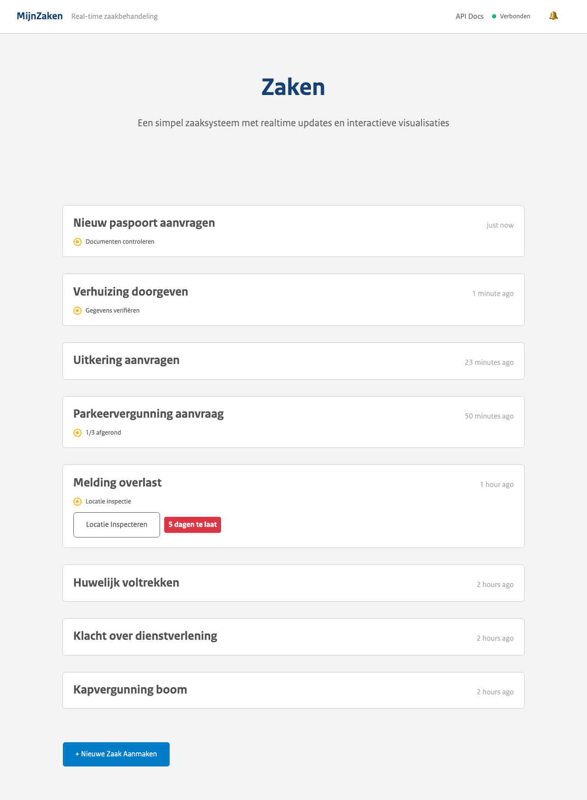

# MijnZaken - SSE Demo

Dit is een simpele front-end applicatie om te demonstreren hoe Server-Sent Events (SSE) zouden kunnen werken voor MijnZaken.


Dit project bevat:

- **Front-end voor MijnZaken**, met real-time updates, commenting, planningen, acties en overzichtweergave.
- **Back-end** met een `/events` endpoint en `/schemas` endpoints voor JSON schema serving.
- **AsyncAPI specificatie** voor het protocol op basis van CloudEvents + SSE, met daarin schemas voor de verschillende berichten.



## Lokaal draaien

```sh
# Zorg dat pnpm, node, cargo, en shuttle zijn geinstalleerd

# Installeer de vereiste dependencies
pnpm i

# Genereer de schema's
pnpm run generate-all

# Start de front-end applicatie
pnpm run dev

# Start de back-end applicatie
shuttle run

# Start de AsyncAPI portal voor de specificaties
pnpm run spec

# Start de tests
pnpm run test
pnpm run test:e2e
pnpm run test:e2e:one "schema form"
```
